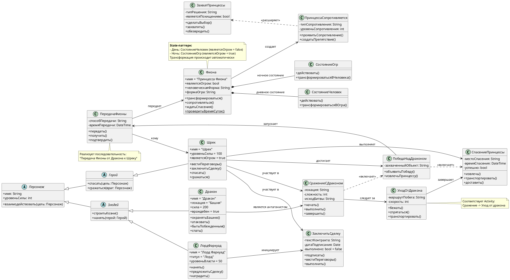

# Class Diagram: Шрек

## Обзор

Эта диаграмма классов показывает объектно-ориентированную структуру ключевых персонажей, взаимодействий и событий из анимационного фильма «Шрек».

---

## Иерархия классов

### Иерархия персонажей

| Class | Type | Attributes | Methods |
|-------|------|------------|---------|
| Персонаж | Abstract | + имя: String, + уровеньСилы: int | + взаимодействовать(цель: Персонаж) |
| Герой | Abstract | extends Персонаж | + спасать(цель: Персонаж), + сражаться(враг: Персонаж) |
| Шрек | Concrete | + имя = "Шрек", + уровеньСилы = 100, + являетсяОгром = true | + вестиПереговоры(), + заключитьСделку(), + спасать(), + сражаться() |
| Злодей | Abstract | extends Персонаж | + строитьКозни(), + нанять(герой: Герой) |
| ЛордФаркуад | Concrete | + имя = "Лорд Фаркуад", + титул = "Лорд", + уровеньВласти = 50 | + нанять(), + предложитьСделку(), + наградить() |
| Дракон | Concrete | + имя = "Дракон", + локация = "Башня", + сила = 200, + враждебен = true | + охранятьБашню(), + атаковать(), + бытьПобежденным(), + спать() |


### Иерархия действий и событий

| Class | Type | Attributes | Methods |
|-------|------|------------|---------|
| ЗаключитьСделку | Concrete | - текстКонтракта: String, - датаПодписания: Date, - выполнено: bool = false | + подписать(), + вестиПереговоры(), + выполнить() |
| СражениеСДраконом | Concrete | - локация: String, - сложность: int, - исходБитвы: String | + начать(), + выполнить(), + завершить() |
| ПобедаНадДраконом | Concrete | - захваченныйОбъект: String | + объявитьПобеду(), + извлечьПринцессу() |
| СпасениеПринцессы | Concrete | - местоСпасения: String, - времяСпасения: DateTime, - успешно: bool | + извлечь(), + транспортировать(), + доставить() |
| ПринцессаСопротивляется | Concrete | - типСопротивления: String, - уровеньСопротивления: int | + проявитьСопротивление(), + создатьПрепятствие() |
| ЗахватПринцессы | Concrete | - типРешения: String, - являетсяПохищением: bool | + сделатьВыбор(), + захватить(), + обезвредить() |
| ПередачаФионы | Concrete | - способПередачи: String, - времяПередачи: DateTime | + передать(), + получить(), + подтвердить() |
| УходОтДракона | Concrete | - маршрутПобега: String, - скорость: int | + бежать(), + спрятаться(), + транспортировать() |


---

## Связи

- **Шрек --> ЗаключитьСделку**: участвует в
- **ЛордФаркуад --> ЗаключитьСделку**: инициирует
- **Шрек --> СражениеСДраконом**: участвует в
- **Дракон --> СражениеСДраконом**: является антагонистом
- **Шрек --> ПобедаНадДраконом**: достигает
- **Шрек --> СпасениеПринцессы**: выполняет
- **Фиона --> ПринцессаСопротивляется**: создает
- **СражениеСДраконом ..> ПобедаНадДраконом**: <<включает>>
- **ПобедаНадДраконом ..> СпасениеПринцессы**: <<включает>>
- **ЗахватПринцессы <.. ПринцессаСопротивляется**: <<расширяет>>
- **Фиона *-- СостояниеЧеловек**: дневное состояние (композиция)
- **Фиона *-- СостояниеОгр**: ночное состояние (композиция)
- **ПобедаНадДраконом --> ПередачаФионы**: запускает
- **ПередачаФионы --> Фиона**: передает
- **ПередачаФионы --> Шрек**: кому
- **СражениеСДраконом --> УходОтДракона**: следует за
- **УходОтДракона --> СпасениеПринцессы**: завершает

---

## Шаблоны проектирования

### State-паттерн (для Фионы)
```java
// Дневное состояние
class СостояниеЧеловек {
    public void действовать() {
        // Фиона ведет себя как человек
        являетсяОгром = false;
    }
    public void трансформироватьсяВОгра() {
        // переход в СостояниеОгр
    }
}

// Ночное состояние
class СостояниеОгр {
    public void действовать() {
        // Фиона превращается в огра
        являетсяОгром = true;
    }
    public void трансформироватьсяВЧеловека() {
        // переход в СостояниеЧеловек
    }
}
```

### Шаблон "Фабричный метод" (для сделок)
```java
public Сделка создатьСделку(тип: String) {
    if (тип == "освобождение") 
        return new СпасениеПринцессы()
    else if (тип == "передача")
        return new ПередачаФионы()
    else 
        return new ЗаключитьСделку()
}
```

---

## Заметки

- **Шрек** — главный герой, обладает максимальной силой (100), способен и сражаться, и вести переговоры
- **Дракон** — самый сильный противник (сила = 200), но может быть побеждён хитростью
- **Фиона** использует **State-паттерн**: днём она человек, ночью — огр
- **Лорд Фаркуад** — антагонист, который предпочитает нанимать героев, а не сражаться сам
- **Мышь** из первой диаграммы здесь отсутствует, но могла бы быть персонажем второго плана :)

---

## Диаграмма



