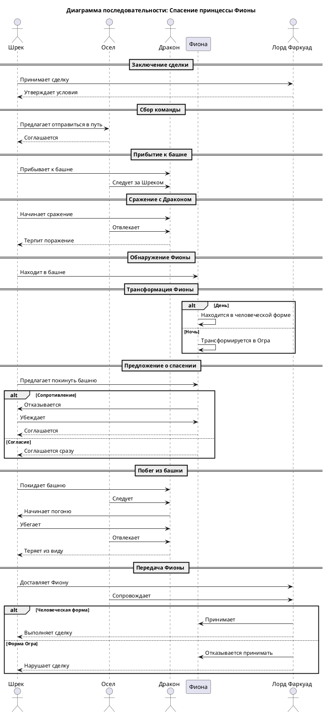

# Sequence Diagram: Взаимодействие персонажей в спасении Фионы

## Обзор

Эта диаграмма последовательности показывает порядок обмена сообщениями между персонажами анимационного фильма «Шрек» — от заключения сделки до финальной передачи принцессы.

---

## Участники

| Актёр / Участник | Тип | Роль |
|------------------|-----|------|
| Шрек | Actor | Главный герой, спасатель |
| Осел | Actor | Компаньон, помощник |
| Дракон | Actor | Антагонист, охранник башни |
| Фиона | Participant | Спасаемая принцесса |
| Лорд Фаркуад | Actor | Заказчик сделки |

---

## Описание потока сообщений

### Этап 1: Заключение сделки
- **Шрек → Лорд Фаркуад:** Принимает сделку
- **Лорд Фаркуад → Шрек:** Утверждает условия

### Этап 2: Сбор команды
- **Шрек → Осел:** Предлагает отправиться в путь
- **Осел → Шрек:** Соглашается

### Этап 3: Прибытие к башне
- **Шрек → Дракон:** Прибывает к башне
- **Осел → Дракон:** Следует за Шреком

### Этап 4: Сражение с Драконом
- **Шрек → Дракон:** Начинает сражение
- **Осел → Дракон:** Отвлекает
- **Дракон → Шрек:** Терпит поражение

### Этап 5: Обнаружение Фионы
- **Шрек → Фиона:** Находит в башне

### Этап 6: Трансформация Фионы (альтернатива)
- **Альтернатива 1 (День):** Фиона находится в человеческой форме
- **Альтернатива 2 (Ночь):** Фиона трансформируется в Огра

### Этап 7: Предложение о спасении (вложенная альтернатива)
- **Шрек → Фиона:** Предлагает покинуть башню
- **Вариант А (Сопротивление):**
  - Фиона → Шрек: Отказывается
  - Шрек → Фиона: Убеждает
  - Фиона → Шрек: Соглашается
- **Вариант Б (Согласие):**
  - Фиона → Шрек: Соглашается сразу

### Этап 8: Побег из башни
- **Шрек → Дракон:** Покидает башню
- **Осел → Дракон:** Следует
- **Дракон → Шрек:** Начинает погоню
- **Шрек → Дракон:** Убегает
- **Осел → Дракон:** Отвлекает
- **Дракон → Шрек:** Теряет из виду

### Этап 9: Передача Фионы (финальная альтернатива)
- **Шрек → Лорд Фаркуад:** Доставляет Фиону
- **Осел → Лорд Фаркуад:** Сопровождает
- **Альтернатива 1 (Человеческая форма):**
  - Лорд Фаркуад → Фиона: Принимает
  - Лорд Фаркуад → Шрек: Выполняет сделку
- **Альтернатива 2 (Форма Огра):**
  - Лорд Фаркуад → Фиона: Отказывается принимать
  - Лорд Фаркуад → Шрек: Нарушает сделку

---

## Типы сообщений

| Тип | Описание | Пример |
|-----|----------|--------|
| Синхронный вызов (→) | Запрос с ожиданием ответа | Шрек → Лорд Фаркуад: Принимает сделку |
| Ответ (-->) | Возврат от вызываемого к вызывающему | Лорд Фаркуад --> Шрек: Утверждает условия |
| Самообращение (->) | Внутреннее действие участника | Фиона → Фиона: Трансформируется в Огра |

---

## Альтернативные блоки (alt)

| Блок | Условие | Ветка 1 | Ветка 2 |
|------|---------|---------|---------|
| Трансформация Фионы | Время суток | День → человеческая форма | Ночь → форма Огра |
| Реакция Фионы | Сопротивление | Отказ → убеждение → согласие | Согласие сразу |
| Финальная передача | Форма Фионы | Человеческая → принятие сделки | Форма Огра → нарушение сделки |

---

## Диаграмма

